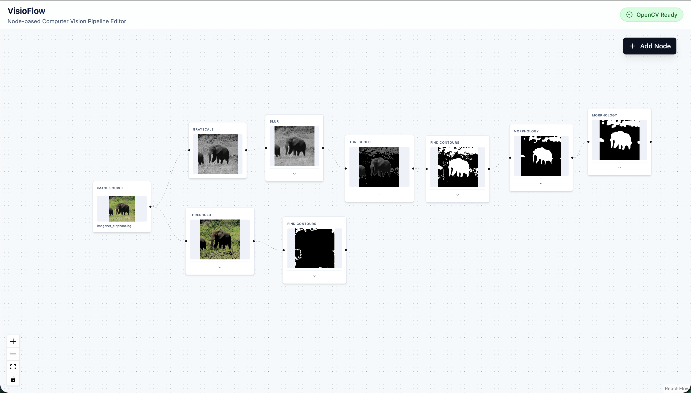

# VisioFlow

VisioFlow is a powerful, node-based computer vision pipeline editor built with React and OpenCV.js. It allows users to visually design and execute image processing workflows directly in the browser.

<p align="center">
  
</p>


## Features

- **Visual Pipeline Editor**: intuitive drag-and-drop interface creating processing graphs.
- **Real-time Processing**: Powered by OpenCV.js (WebAssembly) for high-performance image manipulation in the browser.
- **Extensible Node System**: Architecture designed for easy addition of new processing nodes.
- **Responsive Design**: Modern UI built with TailwindCSS and shadcn/ui components.

## Available Nodes

- **Image Source**: Load images from your local file system.
- **Grayscale**: Convert images to grayscale.
- **Gaussian Blur**: Apply configurable blur effects.
- **Canny Edge Detection**: Detect edges in images with adjustable thresholds.

## Getting Started

### Prerequisites

- Node.js (v18 or higher recommended)
- npm

### Installation

1. Clone the repository:
   ```bash
   git clone https://github.com/FlorianVal/ComputerVisionFlowUI.git
   cd ComputerVisionFlowUI
   ```

2. Install dependencies:
   ```bash
   npm install
   ```

3. Start the development server:
   ```bash
   npm run dev
   ```

4. Open your browser and navigate to `http://localhost:5173` (or the port shown in your terminal).

## Architecture

VisioFlow leverages:
- **ReactFlow** for the canvas and graph state management.
- **OpenCV.js** for client-side image processing.
- **Web Workers / Async Processing** (Architecture pattern) to keep the UI responsive during heavy computation.

## Project Structure

- `src/nodes/`: Contains individual node implementations.
- `src/components/`: Reusable UI components.
- `src/services/`: Pure logic for image processing (OpenCV interactions).
- `src/hooks/`: Custom React hooks for processing state and OpenCV context.

## License

[MIT](LICENSE)
