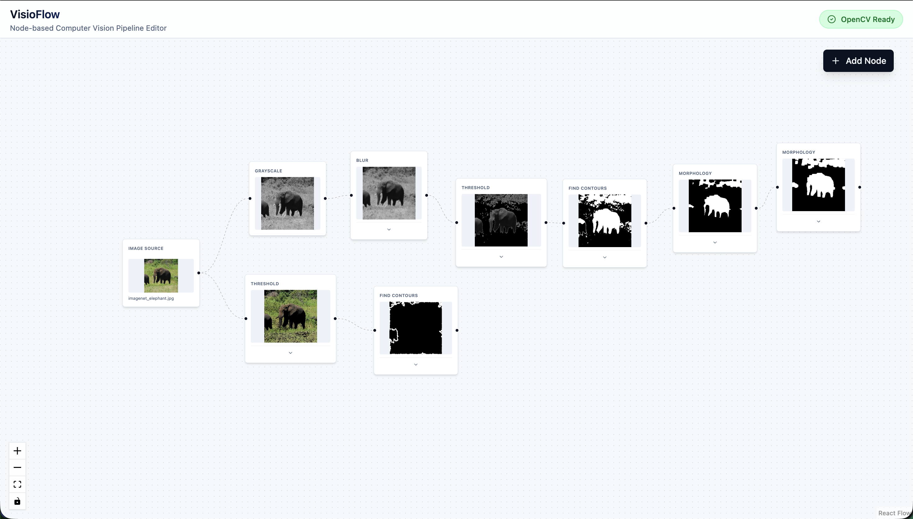

# VisioFlow

VisioFlow is a powerful, node-based computer vision pipeline editor built with React and OpenCV.js. It allows users to visually design and execute image processing workflows directly in the browser with high performance and real-time feedback.

<p align="center">
  
</p>

## ✨ Features

- **Visual Pipeline Editor**: Intuitive drag-and-drop interface powered by **ReactFlow**.
- **Real-time Processing**: High-performance image manipulation powered by **OpenCV.js (WebAssembly)**.
- **Async Architecture**: Non-blocking UI using asynchronous processing patterns for smooth interactions during heavy computation.
- **Live Previews**: Every node provides a real-time visual preview of its processing result.
- **Smart UI Components**: Dynamic controls that adapt to input data (e.g., Threshold sliders that adapt to channel count).
- **Extensible System**: Modular architecture designed for effortless addition of new computer vision nodes.

## 🛠 Available Nodes

### Input
- **Image Source**: Load images from your local file system or via URL.

### Filters & Processing
- **Grayscale**: High-performance conversion to grayscale.
- **Gaussian Blur**: Soften images with adjustable strength and blur types (Gaussian, Box, Median).
- **Canny Edge Detection**: Detect precise edges with dual-threshold hysteresis.
- **Threshold**: Multi-channel adaptive thresholding with support for RGB and Grayscale ranges.
- **Morphological Ops**: Apply Erosion and Dilation with configurable iterations for mask refinement.
- **Find Contours**: Detect and draw object boundaries with optional filling for masking.

### Transformations
- **Rotate**: Rotate images by any angle.
- **Brightness**: Adjust image brightness and contrast levels.

## 🚀 Getting Started

### Prerequisites

- **Node.js**: v18 or higher recommended
- **npm**: v9 or higher

### Installation

1. **Clone the repository**:
   ```bash
   git clone https://github.com/FlorianVal/ComputerVisionFlowUI.git
   cd ComputerVisionFlowUI
   ```

2. **Install dependencies**:
   ```bash
   npm install
   ```

3. **Start the development server**:
   ```bash
   npm run dev
   ```

4. **Access the application**:
   Open your browser and navigate to `http://localhost:5173`.

## 🏗 Architecture

VisioFlow is built with a modern, decoupled architecture:
- **ReactFlow**: Canvas orchestration and graph state management.
- **OpenCV.js**: WASM-powered engine for core image processing.
- **Custom Data Layer**: Type-safe communication between nodes with automatic validation.
- **Service Layer**: Pure, async image processing logic separated from UI components.

## 📁 Project Structure

- `src/nodes/`: individual node implementations and registry.
- `src/services/`: pure OpenCV.js processing logic.
- `src/hooks/`: logic for async processing and context management.
- `src/data/`: data validation and node communication protocols.
- `src/components/ui/`: reusable design system components.

## ➕ Adding a New Node

To add a new node to VisioFlow, follow these steps:

1. **Create the node component** in `src/nodes/MyNewNode.jsx`, extending the base node pattern.

2. **Register the node** in `src/nodes/index.js`:
   - Import the component:
     ```js
     import MyNewNode from './MyNewNode'
     ```
   - Add it to the `nodeTypes` registry (this is what ReactFlow uses to render it):
     ```js
     export const nodeTypes = {
         // ...existing nodes...
         myNewNode: MyNewNode,
     }
     ```
   - Add it to the named exports at the bottom:
     ```js
     export { ..., MyNewNode }
     ```

3. **Add the node to the Add Node menu** in `src/components/AddNodeMenu.jsx` by appending an entry to the `nodeDefinitions` array:
   ```js
   {
       type: 'myNewNode',       // must match the key used in nodeTypes
       label: 'My New Node',
       description: 'Short description of what this node does',
       icon: SomeIcon,          // import from lucide-react
       category: 'Filter',      // Input | Filter | Transform | Adjust
   }
   ```

> **Important**: The `type` field in `nodeDefinitions` must exactly match the key registered in `nodeTypes`, otherwise the node will not render when added from the menu.

## 📄 License

This project is licensed under the [MIT License](LICENSE).
